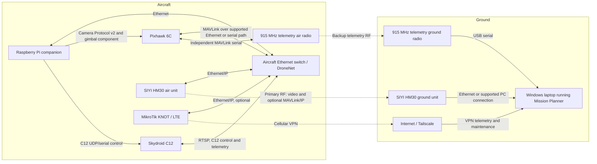
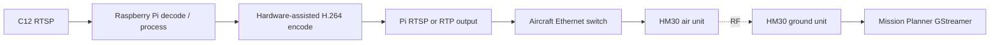

# Recommended Video Downlink Architecture

## Decision

Use a **SIYI HM30 Ethernet image/data link as the primary video downlink**, with the Skydroid C12, Raspberry Pi companion computer, Pixhawk Ethernet interface, and HM30 air unit connected through the aircraft Ethernet switch.

The primary video path should remain IP-native:

```text
Skydroid C12 RTSP/H.264
    -> aircraft Ethernet switch
    -> HM30 air unit
    -> HM30 RF link
    -> HM30 ground unit Ethernet
    -> Windows ground-station laptop
    -> Mission Planner GStreamer video source
```

The Raspberry Pi should not decode and re-encode the normal flight video path. It should provide MAVLink Camera Protocol v2 and C12 command translation, monitor stream health, and optionally publish a processed stream later when overlays or image processing are actually required.

This recommendation replaces the proposed HDMI-to-VTX-to-video-receiver path as the normal operating architecture. An analog or HDMI VTX can still be retained as an independent experimental or emergency FPV path, but it should not be the only way to get C12 imagery into Mission Planner.

## Why this is the best fit for this aircraft

The platform is a large payload-capable multirotor rather than a mass-constrained racing aircraft. The HM30 air unit and power hardware add weight, but the gain in integration simplicity, maintainability, and ground-station usability is more important for this frame and mission.

The main reasons for selecting HM30 are:

1. **Mission Planner receives a normal IP video stream.** Mission Planner can open an RTSP stream through a GStreamer pipeline, so no USB capture receiver or separate display is required.
2. **The C12 already produces Ethernet RTSP streams.** Keeping the path in Ethernet/IP form avoids unnecessary C12 decode, HDMI display generation, RF re-encoding, ground capture, and another decode stage.
3. **Windows is the primary ground-station environment.** HM30 presents an ordinary network connection to the Windows laptop. WFB-ng is technically capable and remains a useful test option, but its supported monitor-mode adapters, patched drivers, and Linux-oriented ground setup add operational complexity around a Windows Mission Planner workflow.
4. **The airframe can support the hardware.** The HM30 air unit is approximately 74 g before antennas and any high-voltage power module. This is reasonable on the target heavy-lift frame.
5. **Dual-stream support is aligned with the C12.** HM30 is advertised for dual-channel full-HD video, subject to verification with the actual C12 bitrates and codecs.
6. **The transport remains separate from MAVLink.** Camera Protocol v2 advertises and controls streams; HM30 transports the actual IP media packets.
7. **Existing telemetry paths remain independent.** The 915 MHz telemetry radio should remain available as a low-bandwidth backup, and LTE/Tailscale can remain a tertiary remote-access path.

## Important compatibility condition

Mission Planner on Windows should be treated as **H.264-only for this HM30 path** unless bench testing proves otherwise. Configure the C12 visible and thermal streams for H.264 when possible. Do not commit to an H.265-only configuration for the operational Mission Planner feed.

Before purchasing or finalizing wiring, verify these items with the real hardware:

- C12 visible and thermal RTSP URLs
- C12 codec selection and whether both streams can be set to H.264
- Per-stream resolution, frame rate, bitrate, and keyframe interval
- HM30 firmware behavior with arbitrary third-party RTSP sources
- Whether both streams are routed transparently at the required aggregate bitrate
- Mission Planner GStreamer compatibility with each stream
- End-to-end latency and recovery after RF interruption

## Recommended system routing



### Functional separation

| Function | Primary path | Backup or alternate path |
| --- | --- | --- |
| Visible video | C12 RTSP -> HM30 -> Mission Planner | LTE only for testing/remote troubleshooting; optional separate FPV system |
| Thermal video | C12 RTSP -> HM30 -> Mission Planner | LTE only if bandwidth and data plan permit |
| Camera/gimbal commands | Mission Planner MAVLink -> FC/router -> Pi bridge -> C12 | Same commands over 915 MHz or LTE MAVLink route |
| Flight telemetry | HM30 IP/MAVLink or existing primary telemetry design | Independent 915 MHz radio |
| Remote maintenance | LTE/Tailscale -> Pi | Local Ethernet/Wi-Fi on bench |

## Video routing modes

### Mode A: Direct C12 stream, preferred


Use this mode for normal operation. It minimizes processing stages and leaves the Raspberry Pi available for control, health monitoring, logging, and camera metadata.

### Mode B: Raspberry Pi processed stream



Use this mode only when overlays, picture-in-picture, stabilization experiments, detection, or another pixel-changing operation is required. Any pixel modification forces decode and re-encode, increasing latency, CPU/GPU load, heat, and failure modes.

## Camera Protocol v2 behavior

The bridge should publish one `VIDEO_STREAM_INFORMATION` instance for each stream actually available at the ground station.

For the direct HM30 path, the advertised URI should be the RTSP URI reachable by the Mission Planner laptop through the HM30 ground network. Do not advertise the aircraft-side URI until routing has been verified from the ground side.

Suggested logical mapping:

| Stream ID | Content | MAVLink stream type | Notes |
| ---: | --- | --- | --- |
| 1 | Visible | `VIDEO_STREAM_TYPE_RTSP` | Prefer H.264 for Mission Planner on Windows |
| 2 | Thermal | `VIDEO_STREAM_TYPE_RTSP` | Set thermal flag; verify H.264 and aggregate bandwidth |
| 3 | Processed/composite, optional | `VIDEO_STREAM_TYPE_RTSP` or `VIDEO_STREAM_TYPE_RTPUDP` | Published by the Pi only when enabled |

The implementation should obtain addresses, ports, resolution, frame rate, bitrate, rotation, and status from configuration or measured camera data. It should not hard-code unverified C12 values.

## Parts list

### Required airborne hardware

| Part | Purpose | Selection notes |
| --- | --- | --- |
| SIYI HM30 air unit | Primary digital RF link | Use current hardware revision; confirm supported input voltage |
| HM30 ground unit | Ground Ethernet/IP endpoint | Connect to Mission Planner laptop over the supported LAN/USB arrangement |
| HM30 antenna set | RF link | Use matched antennas; never power the transmitter without antennas |
| HM30 4S-18S power module, if required | Powers HM30 from the aircraft battery | Appropriate when the aircraft bus exceeds the direct-input range of the air unit |
| Aircraft Ethernet switch / BotBlox DroneNet | Connects Pi, C12, HM30, and flight-controller network | Confirm port count, connector type, and power budget |
| Raspberry Pi companion computer | Camera Protocol v2 bridge, C12 control, monitoring | Raspberry Pi OS Lite 64-bit; wired Ethernet preferred |
| C12 Ethernet harness | Connects C12 to switch | Verify C12 connector pinout and cable shielding |
| HM30 LAN harness | Connects air unit to switch | Use the SIYI cable or a verified adapter; do not assume standard wire colors |
| Fused power wiring and connectors | Safe power distribution | Size for HM30 peak power plus margin |

### Recommended ground hardware

| Part | Purpose |
| --- | --- |
| Windows laptop with Mission Planner and GStreamer support | Primary GCS and video display |
| Ethernet port or known-good USB Ethernet adapter | HM30 ground network connection |
| Independent 915 MHz telemetry ground radio | Backup flight telemetry and command path |
| Tripod or mount for HM30 ground unit/antenna | Stable antenna orientation and strain relief |

### Optional hardware

- Separate low-latency FPV camera and analog/digital pilot link, independent of the C12 payload
- Directional HM30 ground antenna for range testing
- Managed bench switch or Ethernet tap for packet capture
- Inline current/voltage monitor for HM30 power characterization
- LTE/Tailscale modem for remote support and tertiary telemetry

## Wiring diagrams

### Airborne signal wiring

```text
                         AIRCRAFT ETHERNET LAN

 Pixhawk 6C / ETH adapter ----+
                              |
 Raspberry Pi Ethernet -------+---- [Ethernet switch / DroneNet] ---- HM30 AIR LAN
                              |
 Skydroid C12 Ethernet -------+
                              |
 MikroTik KNOT Ethernet ------+  (only if a port is available/required)

 Pixhawk TELEM port ---------------- 915 MHz telemetry air radio
 Raspberry Pi control interface ---- C12 control interface, as required by final protocol
```

Do not connect two DHCP servers to the aircraft LAN. Prefer static addressing for flight hardware, or one deliberately managed DHCP server with fixed leases.

### Airborne power wiring

```text
Aircraft battery / protected power distribution
    |
    +-- flight-controller power modules
    |
    +-- fused regulated 5 V rail ---------- Raspberry Pi
    |
    +-- fused C12-rated supply ------------- Skydroid C12
    |
    +-- fused HM30 supply ------------------ HM30 air unit
           |
           +-- direct input only if battery voltage is within the
               exact hardware revision's supported range
           +-- otherwise use the SIYI 4S-18S power module
```

Keep high-current power wiring away from Ethernet, GNSS, compass, and RF coax. Provide strain relief and airflow for the HM30 fan and Raspberry Pi cooling system.

### Ground wiring

```text
HM30 ground unit LAN
    -> Ethernet cable or verified SIYI adapter
    -> Windows laptop Ethernet / USB Ethernet adapter
    -> Mission Planner

915 MHz ground radio
    -> USB
    -> Windows laptop
```

Use separate network interface metrics or static routes so the HM30 network does not replace the laptop's normal Internet default route unless that behavior is intentional.

## Addressing example

The actual HM30 and C12 defaults must be checked before use. A clean static plan could look like this:

| Device | Example address | Role |
| --- | --- | --- |
| Aircraft switch management, if any | `192.168.144.1` | Optional management only |
| Pixhawk Ethernet endpoint | `192.168.144.10` | MAVLink endpoint |
| Raspberry Pi | `192.168.144.20` | Bridge and optional processed RTSP server |
| C12 | `192.168.144.30` | Camera/gimbal and RTSP source |
| HM30 air/bridge endpoint | Vendor-defined or transparent | RF Ethernet bridge |
| Mission Planner laptop HM30 NIC | `192.168.144.100` | Ground consumer |

This table is illustrative. Avoid changing vendor defaults until the C12 and HM30 can be reached independently on the bench.

## Mission Planner setup

1. Connect the laptop to the HM30 ground unit network.
2. Confirm the C12 is reachable from Windows with `ping` where supported and verify the RTSP stream in a standalone GStreamer or VLC test.
3. In Mission Planner, open the Data screen and choose **Set GStreamer Source** or the gimbal video stream selector.
4. Start with an H.264 RTSP pipeline similar to:

```text
rtspsrc location=rtsp://C12_ADDRESS:PORT/PATH latency=50 udp-reconnect=1 timeout=0 do-retransmission=false ! application/x-rtp ! decodebin3 ! queue max-size-buffers=1 leaky=2 ! videoconvert ! video/x-raw,format=BGRA ! appsink name=outsink sync=false
```

5. Replace the address, port, and path with the verified C12 stream URI.
6. Tune `latency` only after packet-loss and recovery testing. Extremely low values may reduce delay while making the display less tolerant of jitter.
7. Repeat for the thermal stream in a second Mission Planner video window if supported by the selected workflow.

## Network and service routing

Use `mavlink-routerd` rather than MAVProxy for the dedicated onboard routing service unless a MAVProxy module is specifically needed.

A target architecture is:

```text
Pixhawk MAVLink
    -> mavlink-routerd on Pi or direct Ethernet routing
        -> local UDP endpoint for c12-bridge
        -> HM30 network endpoint for Mission Planner
        -> LTE/Tailscale endpoint, rate-limited

Pixhawk independent TELEM UART
    -> 915 MHz telemetry radio
```

The C12 bridge and video pipeline must not compete for the same UDP bind address. Assign separate ports for MAVLink routing, C12 control, stream metadata, and any processed RTP output.

## Validation plan

### Phase 1: Local Ethernet bench

- Connect laptop, Pi, C12, and switch without HM30.
- Verify both C12 streams and record codec, bitrate, frame rate, and latency.
- Display each stream in Mission Planner.
- Verify Camera Protocol v2 stream discovery and gimbal commands.

### Phase 2: HM30 single-stream bench

- Insert the HM30 link between the aircraft LAN and laptop.
- Test the visible H.264 stream first.
- Record latency, jitter, packet loss, bitrate, reconnect time, and video artifacts.
- Test simultaneous MAVLink traffic without saturating the link.

### Phase 3: Dual stream

- Add thermal video.
- Measure aggregate bitrate and RF-link margin.
- Reduce resolution or bitrate before sacrificing keyframe recovery behavior.
- Verify that loss of one stream does not stop the other or block MAVLink.

### Phase 4: Interference and range

- Test with the aircraft motors operating on the bench under appropriate safety restraints.
- Test antenna placement, orientation, and separation from GNSS, RC, LTE, and 915 MHz systems.
- Perform incremental ground range tests before flight range tests.
- Define a conservative operational limit from measured link margin rather than advertised maximum range.

### Phase 5: Processed stream, optional

- Add Pi decode/processing/encode only after the direct path is stable.
- Measure Pi CPU/GPU usage, throttling, temperature, encoder latency, and memory growth.
- Keep the direct C12 stream available as a diagnostic fallback.

## Failure behavior

- Loss of HM30 video must not affect flight control.
- Loss of the Raspberry Pi must not remove the independent 915 MHz telemetry path.
- Loss of LTE must not affect routine control or video.
- The flight controller must retain all normal failsafe behavior without depending on the camera bridge.
- The bridge should mark streams unavailable when RTSP or HM30 reachability checks fail, rather than continuing to advertise a stale running stream.

## Why WFB-ng is not the primary recommendation

WFB-ng is a strong low-latency transport and should remain a viable engineering experiment. It offers raw-Wi-Fi packet transport, configurable FEC, encryption, MAVLink service support, and detailed link statistics.

It is not the first recommendation here because the intended GCS is Mission Planner on Windows. A production-quality WFB-ng setup normally adds supported monitor-mode adapters, patched drivers, careful 5 V high-current power and cooling on the aircraft, and a Linux ground endpoint. A ground Raspberry Pi could receive WFB-ng and forward RTP over Ethernet to the Windows laptop, but that recreates a two-computer ground system and increases maintenance burden.

Choose WFB-ng instead of HM30 only when bench testing shows that its latency, packet-loss behavior, openness, or cost provides a material advantage worth the additional Linux RF integration work.

## Why analog/HDMI is not the primary recommendation

The proposed HDMI/VTX path requires the Pi to decode both C12 streams and create a display output, then requires a ground receiver and potentially a USB capture device before Mission Planner can display it. It also combines or selects streams before transmission, limiting independent visible/thermal stream handling.

That path remains useful for a dedicated pilot FPV view or low-cost fallback test, but it is less suitable for inspection imagery and Mission Planner integration than an end-to-end IP path.

## References

- [Mission Planner live video](https://ardupilot.org/planner/docs/live-video.html)
- [SIYI HM30 product page](https://www.siyi.biz/en/product/image-digital-link/hm30/)
- [SIYI HM30 specifications](https://www.siyi.biz/en/product/image-digital-link/hm30/spec/)
- [WFB-ng project](https://github.com/svpcom/wfb-ng)
- [WFB-ng setup guide](https://github.com/svpcom/wfb-ng/wiki/Setup-HOWTO)
- [Existing video path comparison](video-path-options.md)
- [Existing proposed routing source](proposed_pathing.mmd)
